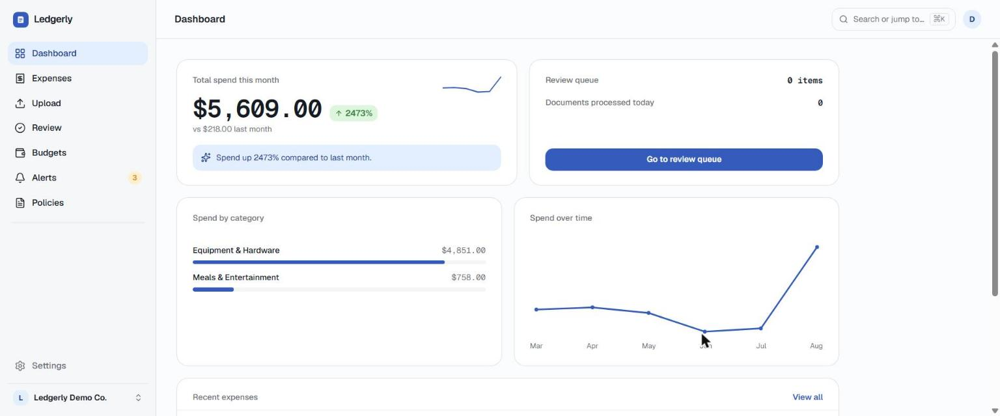
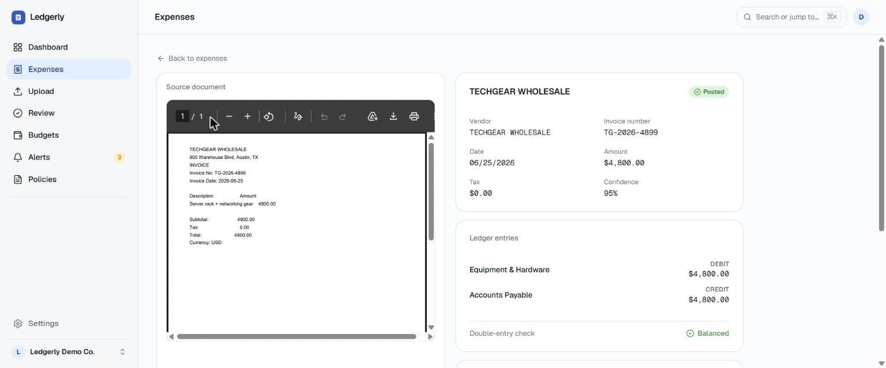

# Ledgerly

[](https://github.com/emirhancebiroglu/ledgerly/actions/workflows/ci.yml)
[](LICENSE)

AI-assisted corporate expense ledger. Upload an invoice, an LLM-backed pipeline extracts and
categorizes it against your org's own expense policies, and the system posts a balanced
double-entry ledger transaction — or routes it to a human review queue when it isn't confident
enough to post silently.

**Live demo:** [ledgerly-ruby-two.vercel.app](https://ledgerly-ruby-two.vercel.app)
**Demo account:** `demo@ledgerly.dev` / `ledgerly-demo-account-2026` (seeded, read-and-explore).

---

## Why this exists

Most expense tools force manual data entry or hand back an unstructured OCR blob and call it
done. Ledgerly closes the loop: a PDF goes in, and a correct, auditable accounting entry comes
out — with the category classification backed by a citation from the org's actual policy
document, not the model's opinion.

It's also a deliberate exercise in the part of "AI features" that's usually skipped in a demo:
what happens when the model is wrong. Every LLM output on the write path is treated as a
proposal, never a fact — validated, cross-checked, and rejected or downgraded to human review
rather than trusted and posted.

## What it actually does

- **Upload → extract → categorize → post**, end to end, with no manual step in between.
- **Double-entry ledger** that cannot represent an unbalanced transaction — enforced in the
  domain model *and* independently by a database constraint, so a bug in one layer can't corrupt
  the books.
- **Policy-aware categorization**: org-uploaded expense policies are chunked, embedded, and
  retrieved (pgvector) as context for classification. The model's citation claim is checked
  against the retrieved text verbatim — an unverifiable citation is discarded rather than
  trusted, without discarding an otherwise-correct category choice.
- **Confidence-gated posting**: below a configurable threshold, an expense goes to a review
  queue instead of the ledger. Nothing is posted on a guess.
- **Anomaly and budget alerts**: category spend is checked against budget thresholds (80%,
  100%) and a statistical anomaly score (z-score against 90-day history) — the LLM writes the
  human-readable explanation, it never invents the number behind it.
- **Duplicate detection** across near-identical invoices (vendor, amount, date proximity).
- **Idempotent writes**: every mutating endpoint requires an `Idempotency-Key`; a replayed key
  returns the original response rather than posting twice, and a replayed key with a *different*
  payload is rejected with `409`.
- **Full audit trail**: every mutation is recorded in the same database transaction as the
  change itself.
- **Multi-currency dashboard**: per-currency totals, category breakdown, and month-over-month
  comparison — no silent currency mixing.

### Known limitations

Written down deliberately, not discovered by a stranger:

- **Policy content is categorization context, not enforcement.** The system retrieves relevant
  policy text and hands it to the model as evidence for *which category* an expense belongs to.
  It does not read a policy's actual rules (a per-person meal limit, an approval threshold above
  a dollar amount, an alcohol-percentage cap) and enforce them — an expense that plainly violates
  a written policy still posts or goes to review purely on categorization confidence. See
  `docs/decisions.md` (2026-08-26) for the full reasoning and what a real enforcement layer would
  require.
- **Storage durability on the free tier.** Uploaded document bytes are stored via a pluggable
  `StorageClient` — Cloudflare R2 in production, local disk elsewhere. Render's free/starter
  compute tier has no persistent disk guarantee outside the attached storage backend; this is a
  documented tradeoff, not an oversight (`docs/decisions.md`).
- **Free-tier compute.** `api` and `ai` run on Render's free tier — both are kept warm by a
  5-minute UptimeRobot heartbeat (Render sleeps a service after 15 minutes idle), but a genuinely
  cold instance's first request can still take 30–60 seconds.
- **Single-region, single-instance.** No horizontal scaling, no read replicas — this is a
  portfolio deployment sized for a demo, not for production load.

## Screenshots

<p>
  
  
</p>

Left: the multi-currency dashboard. Right: an expense detail page — the source document, the
fields extracted from it, and the balanced ledger transaction it produced, side by side.

**The full upload → extract → categorize → post loop** (~90s, recorded against the live deploy
above, no cuts):

https://github.com/user-attachments/assets/7e88f554-9e71-4456-8968-0201b4f7e8b4

## Architecture

```
                        ┌──────────────────────────────┐
                        │  web — Next.js + TypeScript  │
                        │  dashboard, upload, review   │
                        └───────────────┬──────────────┘
                                        │ REST + SSE
                        ┌───────────────▼──────────────┐
                        │  api — Spring Boot 3 / Java  │
                        │  ledger · auth · idempotency │        ┌──────────────┐
                        │  audit trail · budgets       ├────────┤  PostgreSQL  │
                        └───────────────┬──────────────┘        │  + pgvector  │
                                        │ REST (internal)       └──────────────┘
                        ┌───────────────▼──────────────┐               ▲
                        │  ai — FastAPI + LangGraph    ├───────────────┘
                        │  extraction · categorization │
                        │  anomaly · policy RAG        │
                        └───────────────┬──────────────┘
                                        │
                                  ┌─────▼─────┐
                                  │    LLM    │  (provider behind an
                                  └───────────┘   LlmClient port)
```

`api` owns all money and all writes. `ai` is stateless with respect to the ledger — it reads
documents and returns structured proposals, never posts entries itself. That boundary is
deliberate: an LLM must not be on the write path of a financial system. Every LLM output that
reaches `api` is validated (schema, taxonomy membership, currency, arithmetic) before it can
become a ledger row; a validation failure routes to review, it never gets silently discarded or
silently trusted.

Full detail, including the data model and the idempotency decision table: [docs/architecture.md](docs/architecture.md).

## Stack

| Layer | Technology |
|---|---|
| Web | Next.js 16, TypeScript 5, Tailwind CSS 4, shadcn/ui |
| API | Java 21 (Temurin), Spring Boot 3.5, Spring Security, Spring Data JPA, Flyway |
| Data | PostgreSQL 17 + pgvector |
| AI | Python 3.12, FastAPI, LangGraph |
| Observability | Sentry (error tracking, all three services) |
| Infra | Docker Compose (local), GitHub Actions CI, Render (`api`/`ai`/Postgres) + Vercel (`web`) |
| Storage | Cloudflare R2 (production), local disk (dev) |

Pinned versions: [docs/versions.md](docs/versions.md).

## API surface

`api` exposes a REST API under `/api/v1`:

| Area | Endpoints |
|---|---|
| Auth | `POST /auth/register`, `POST /auth/login`, `POST /auth/refresh`, `GET /me` |
| Documents | `POST /documents`, `GET /documents/{id}`, `GET /documents/{id}/content`, `GET /documents/{id}/events` (SSE) |
| Expenses | `GET/POST /expenses`, `GET /expenses/{id}`, `GET /expenses/{id}/detail`, `POST /expenses/{id}/approve`, `POST /expenses/{id}/correct` |
| Categories | full CRUD |
| Budgets | full CRUD |
| Alerts | `GET /alerts`, `GET /alerts/unread-count`, `POST /alerts/{id}/read`, `POST /alerts/{id}/dismiss`, `POST /alerts/read-all` |
| Policies | `GET/POST /policies`, `GET /policies/{id}`, `GET /policies/{id}/chunks` |
| Dashboard | `GET /dashboard/summary` |

`ai` exposes the internal agent surface `api` calls (not public): `/extract`, `/categorize`,
`/anomaly`, `/embed-policy`, `/embed-query`, `/health`.

## Repository layout

```
ledgerly/
├── apps/
│   ├── api/          Spring Boot service — ledger, auth, budgets, alerts
│   ├── ai/           FastAPI service — extraction/categorization/anomaly agents
│   └── web/          Next.js frontend
├── infra/
│   └── docker-compose.yml
├── docs/
│   ├── architecture.md    system design, data model, decision tables
│   ├── milestones.md      how this was built, in order, with a demo command per milestone
│   ├── decisions.md       append-only architectural decision log
│   └── versions.md        every pinned dependency version
└── .github/workflows/     CI: build+test all three services, dependency + secret scanning
```

## Running it locally

Requires Docker and Docker Compose.

```bash
git clone https://github.com/emirhancebiroglu/ledgerly.git
cd ledgerly
cp .env.example .env        # fill in an LLM API key; everything else has a working default
docker compose -f infra/docker-compose.yml up -d --build
```

Then:

```bash
curl -f localhost:8080/actuator/health   # api
curl -f localhost:8000/health            # ai
open localhost:3000                      # web
```

To explore with realistic data instead of an empty org, run `api` with the `demo` Spring
profile active — it seeds one organization with ~3 months of invoices, policies, budgets, and
alerts by replaying recorded fixtures through the real service layer (no LLM calls, no cost, no
non-determinism on boot).

## Testing

```bash
cd apps/api && ./mvnw test      # 219+ tests: unit, property-based (jqwik), Testcontainers integration
cd apps/ai  && pytest           # extraction/categorization/anomaly graph + contract tests
cd apps/web && npm test         # component + integration tests (Vitest)
```

CI runs all three on every push and pull request, plus a dependency vulnerability scan
(Trivy), a committed-secrets scan, and a check that `.env.example` never drifts from what
`docker-compose.yml` actually references.

## Engineering notes worth knowing about

- **Money is never a float.** Storage is `BIGINT` minor units + ISO currency code; arithmetic
  goes through a `Money` value object that rejects currency mismatches at construction.
- **The ledger can't drift.** An unbalanced transaction is rejected by the domain model and,
  independently, by a database constraint — a bug in one layer can't silently corrupt the books.
- **Idempotency is a first-class contract**, not header-sniffing: a replayed key with an
  identical payload returns the original response; a replayed key with a different payload is a
  `409`, not a silent overwrite.
- **The trust boundary was built before the agent that needs it.** Extraction validation
  (currency known, `total == sum(lines) + tax`, sane date range, amount ceiling) shipped in the
  milestone before a real model was ever wired in, specifically so the validation logic wasn't
  shaped around whatever the model happened to get wrong.

## What I'd do next

- Policy rule enforcement (see Known limitations above) — the natural next milestone.
- Multi-tenant rate limiting tuned from real traffic instead of load-test defaults.
- A proper evaluation harness tracking extraction/categorization accuracy over time as prompts
  or the underlying model change, instead of a one-time eval run.

## License

[MIT](LICENSE)
